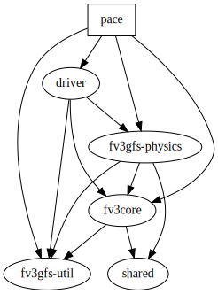

# Pace

Pace is the top level directory that includes the FV3 dynamical core, physics, and util.

If you are visiting for AMS 2022, we recommend you go to `driver/README.md`.

**WARNING** This repo is under active development and relies on code and data that is not publicly available at this point.

## Getting started

Currently, we support tests in the dynamical core, physics, and util.

This git repository is laid out as a mono-repo, containing multiple independent projects. Because of this, it is important not to introduce unintended dependencies between projects. The graph below indicates a project depends on another by an arrow pointing from the parent project to its dependency. For example, the tests for fv3core should be able to run with only files contained under the fv3core and util projects, and should not access any files in the driver or physics packages. Only the top-level tests in Pace are allowed to read all files.



### Dynamical core tests

To run dynamical core tests, first get the test data from inside `fv3core` or `fv3gfs-physics` folder, then build `fv3gfs-integration` docker image at the top level.

```shell
$ cd fv3core
$ make get_test_data
$ cd ../
$ make build
```

To enter the container:
```shell
$ make dev
```

Then in the container, dynamical core serial tests can be run:

```shell
$ pytest -v -s --data_path=/fv3core/test_data/c12_6ranks_standard/ /fv3core/tests
```

For parallel tests:

```shell
$ mpirun -np 6 python -m mpi4py -m pytest -v -s -m parallel --data_path=/fv3core/test_data/c12_6ranks_standard/ /fv3core/tests
```

Additional test options are described under `fv3core` documentation.

### Physics tests

Currently, the supported test case is dynamical core + microphysics: e.g., `c12_6ranks_baroclinic_dycore_microphysics` (gs://vcm-fv3gfs-serialized-regression-data/integration-7.2.5/c12_6ranks_baroclinic_dycore_microphysics).

In the container, physics tests can be run:

```shell
$ pytest -v -s --data_path=/test_data/c12_6ranks_baroclinic_dycore_microphysics/ /fv3gfs-physics/tests --threshold_overrides_file=/fv3gfs-physics/tests/savepoint/translate/overrides/baroclinic.yaml
```

For parallel tests:

```shell
$ mpirun -np 6 python -m mpi4py -m pytest -v -s -m parallel --data_path=/test_data/c12_6ranks_baroclinic_dycore_microphysics/ /fv3gfs-physics/tests --threshold_overrides_file=/fv3gfs-physics/tests/savepoint/translate/overrides/baroclinic.yaml
```

### Util tests

Inside the container, util tests can be run from `/pace-util`:
```shell
$ cd /pace-util
$ make test
```
